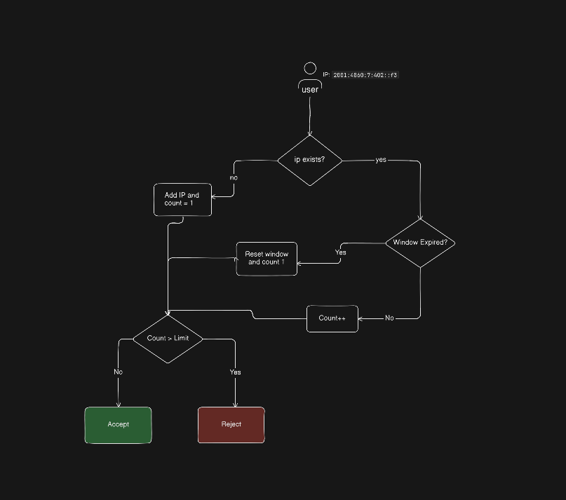

# API Rate Limiting & Audit Logging

### Instructions on how to run the application locally.

Clone the project.

```bash
    git clone https://github.com/tswaliullah/pimjo-task.git
```

Go to project directory

```bash
    cd the project
```

Install require dependance

```bash
    npm install
```

Run server

```bash
npm run dev

```

---

### Rate limiting rules

- Fixed Window Rate Limiting Rule:

  - Check the IP

    - If IP not exist

      - Add IP and set count value 1
      - If count less than limit ACCEPT
      - Otherwise REJECT

    - If IP exist
      - Check Window Expired?
      - If no count 1
        - If count less than limit ACCEPT
        - otherwise REJECT
      - If Yes
      - Reset window and count 1
        - If count less than limit ACCEPT
        - otherwise REJECT

##### Fixed Window rate limiting cons is boundary brusts problem

For Visualize Fixed Wondow Rate Limiting



### Storage choice and reasoning

### Any assumptions or tradeoffs made
